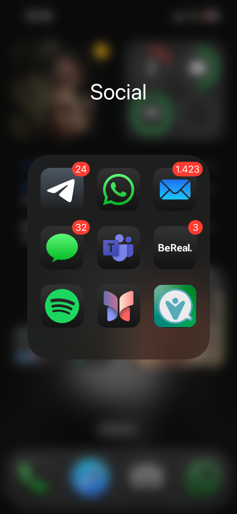
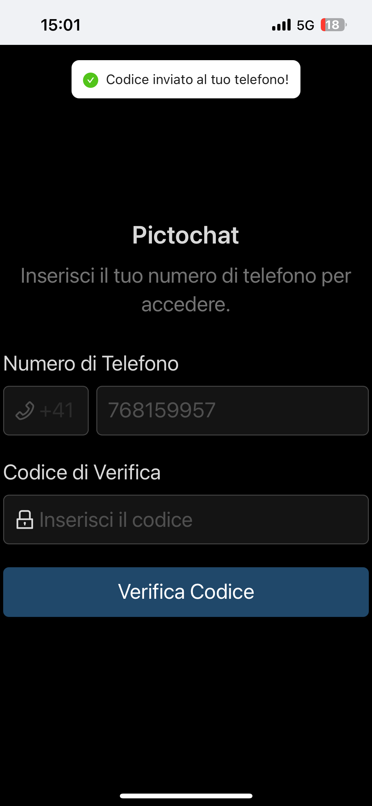
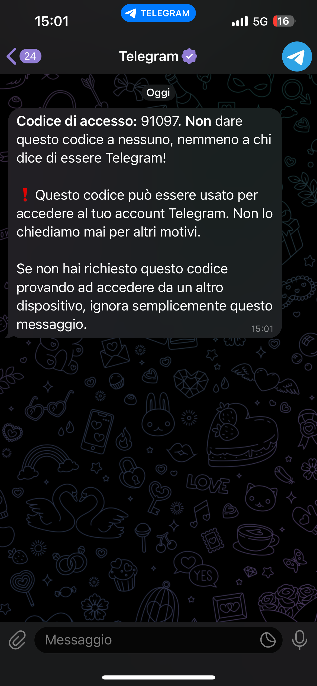
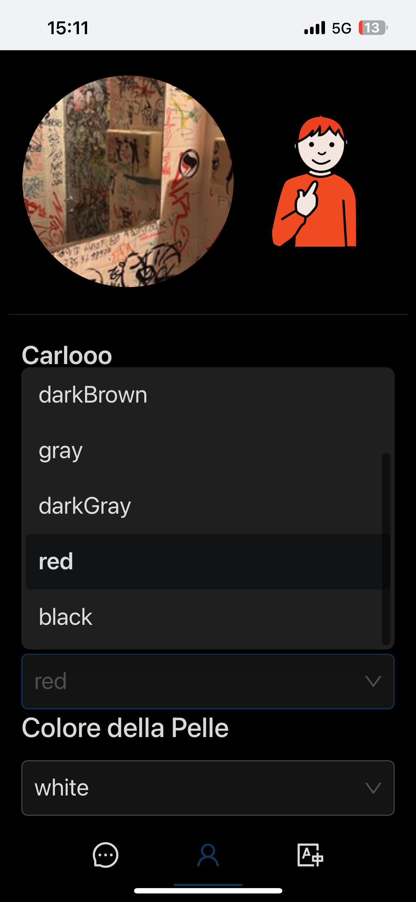

### Manuale Utente: PICTOCHAT
---

### 1. Aggiungere l'App alla Home (Pagina Web)

1. Aprire il **browser** sul proprio telefono (ad esempio Safari su iPhone o Chrome su Android).
2. Accedere alla **pagina web** dell'applicazione.
   - Apparirà una schermata che invita ad aggiungere l'app alla home del dispositivo.

### 2. Aggiungere l'App alla Home

1. **Premere il tasto "Share"** (icona con una freccia che punta verso l'alto o con tre puntini a seconda del telefono).
2. Dal menu che appare, selezionare **"Aggiungi alla Home"**.
3. Confermare cliccando su **Aggiungi** nella finestra successiva.

Risultato: L'app verrà visualizzata sulla schermata principale del dispositivo come una normale applicazione.

---

---
### 3. Aprire l'App dalla Home

1. Nella schermata principale del telefono, individuare l'icona dell'app (con il logo specifico).
2. Toccare l'icona per aprire l'applicazione.
3. Apparirà una pagina con il **pulsante "Accedi"**.
   - Premere su **Accedi** per procedere.

### 4. Accedere all'Applicazione (Login)

**PREMESSA:** L'applicazione richiede un **numero di telefono** per l'accesso. È necessario avere accesso a un telefono con **Telegram** installato per ricevere il codice di verifica.
Quindi prima di impostare l'app bisogna avere un account Telegram.

1. Nella pagina di login, inserire il proprio **numero di telefono** nel campo indicato.
2. Dopo aver inserito il numero, attendere l'arrivo di un **codice di verifica** inviato tramite Telegram.
3. Una volta ricevuto, inserire il codice nella pagina per completare l'accesso.

---

---

### 5. Visualizzare i Contatti

1. Dopo aver effettuato l'accesso, si arriverà alla **pagina dei contatti**.
   - Qui è possibile vedere una lista di contatti con cui è possibile iniziare una chat.
2. Per avviare una conversazione, premere sul nome del contatto desiderato.

### 6. Visualizzare il Profilo e Impostazioni

1. Nella pagina dei contatti, premere sull'**icona del profilo** (in alto o nella barra inferiore).
2. Si aprirà la pagina del **profilo personale**, dove sono visibili:
   - Nome utente
   - Numero di telefono
3. In alto a destra, è possibile **effettuare il logout** dall'applicazione.
4. Scorrendo verso il basso, è possibile accedere alle **impostazioni** dell'app per personalizzare l'esperienza.
5. Nell'immagine viene mostrato come cambiare il colore del proprio personaggio.

---

---

### 7. Aggiungere e Usare le Frasi Veloci

Le frasi veloci permettono di inviare messaggi rapidi senza dover comporre ogni volta nuovi messaggi.

1. Nelle impostazioni o in una chat, è possibile **aggiungere frasi veloci** personalizzate.
2. Scrivere la frase desiderata (ad esempio: *Dove sei?*).
3. **Visualizzazione:**
   - Se viene aggiunto un **testo** nella frase, esso verrà visualizzato come un pittogramma se esiste un corrispondente.
   - Se viene aggiunta un'**emoji**, essa verrà mostrata come emoji.
4. Per inviare una frase veloce, premere su di essa durante la composizione del messaggio.

### 8. Iniziare una Chat

1. Dalla **pagina dei contatti**, selezionare un contatto per aprire la chat.
2. Scrivere il messaggio desiderato o utilizzare i **pittogrammi suggeriti**.
3. Premere l'icona di invio per inviare il messaggio.

Le immagini mostrato prima come avviare una chat su telegram e poi come avviare una chat su pictochat.

---

---

### 9. Invio di Messaggi con Domande e Pittogrammi (Da Telegram)

Per genitori o tutor che inviano messaggi da Telegram:

1. Scrivere il messaggio normalmente e concludere con un **punto di domanda** (esempio: *Cosa vuoi per cena?*).
2. Dopo il punto di domanda, scrivere una lista di **pittogrammi** separati da virgole con uno spazio
3. Esempio completo:
   - *Cosa vuoi per cena? pizza, carne o pesce*
   - Importante: dopo ogni virgola bisogna lasciare uno spazio.

Risultato: L'app suggerirà automaticamente i pittogrammi collegati alla domanda.

### 10. Invio di Frasi Veloci con Pittogrammi o Emoji

1. Dopo aver aggiunto frasi veloci personalizzate:
   - Se contengono **pittogrammi**, questi verranno visualizzati automaticamente.
   - Se contengono **emoji**, appariranno come emoji.
2. Premere sulla frase veloce desiderata per inviarla immediatamente nella chat.

---

### 11. Aggiungere Pittogrammi Personalizzati

I pittogrammi personalizzati possono essere inviati da genitori o tutor seguendo questo formato:

1. Scrivere un messaggio con il seguente formato: **[categoria]:[nome_del_pittogramma]**
   - Esempio: *persone:mamma*.
2. Aggiungere alla fine del messaggio la **foto del pittogramma**.

  

    
<strong>Categorie disponibili:</strong>

    <ul>
      <li>Tempo libero</li>
      <li>Lavoro</li>
      <li>Cibo</li>
      <li>Persone</li>
      <li>Luoghi</li>
      <li>Verbi</li>
      <li>Emozioni</li>
      <li>Tempo</li>
      <li>Oggetti quotidiani</li>
    </ul>
    
Risultato: Il pittogramma personalizzato sarà importato e visibile come parte della categoria.

  

  

    
  

### 12. Visualizzare i Pittogrammi Personalizzati

1. I **pittogrammi personalizzati** verranno visualizzati **per primi** nella lista dei pittogrammi durante:
   - La creazione di una frase.
   - La scelta di risposte rapide.
2. Possono essere gestiti in una pagina dedicata (nota: questa opzione potrebbe non funzionare su tutti i dispositivi).

---